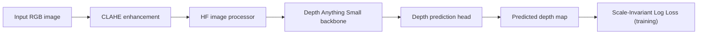

# depth-vision

## Abstract
This project studies monocular depth estimation for underwater scenes by fine-tuning a pretrained **Depth Anything Small** model (`LiheYoung/depth-anything-small-hf`).  
The main goal is to adapt a strong general-depth model to underwater visual conditions (color distortion, low contrast) and evaluate whether fine-tuning improves underwater depth quality.

## Problem Statement
Depth estimation in underwater environments is difficult because water changes image appearance (haze, color attenuation, lighting inconsistency), which often breaks models trained on standard terrestrial images.

This project addresses:
- Can a pretrained monocular depth model be adapted for underwater use?
- How much improvement do we get over the pretrained baseline on underwater-only validation data?

## Project Objective
Build and evaluate an underwater-specialized depth model by:
- Starting from a pretrained transformer-based depth model.
- Fine-tuning on mixed data (`FLSea` + `NYUv2`).
- Evaluating both **baseline pretrained** and **fine-tuned** models on underwater validation (`FLSea`) using standard depth metrics.

## Repository Structure
```text
depth-vision/
├── train.py
├── evaluate.py
├── requirements.txt
├── data/
│   ├── FLSea/
│   ├── NYUv2/
│   └── splits/
│       ├── train_files.txt
│       ├── val_files.txt
│       └── val_flsea.txt
├── src/
│   ├── create_splits.py
│   ├── dataset.py
│   ├── model.py
│   ├── loss.py
│   └── utils.py
└── output/
    ├── best_model.pth
    ├── last_model.pth
    ├── eval/
    └── eval_baseline/
```

## Data and Splits

### Datasets used
- **FLSea** (underwater data)
- **NYUv2** (indoor RGB-D data)

### Training setup
- Fine-tuning uses mixed data from **FLSea + NYUv2**.
- Baseline and fine-tuned comparison is performed on **underwater-only** validation split.

### Split sizes (from current files)
- `data/splits/train_files.txt`: **52,146** pairs
- `data/splits/val_files.txt`: **13,037** pairs
- `data/splits/val_flsea.txt`: **2,842** pairs (underwater evaluation split)

## Method

### Preprocessing (`src/dataset.py`)
- RGB conversion from OpenCV input.
- CLAHE contrast enhancement in LAB color space.
- Resize to model input size from Hugging Face image processor.
- Depth resizing to the same spatial resolution.

### Model (`src/model.py`)
- Base model: `LiheYoung/depth-anything-small-hf`.
- Wrapper: `UnderwaterDepthModel`.
- Fine-tuning strategy: encoder backbone frozen, trainable depth-estimation components updated.

### Loss (`src/loss.py`)
- **Scale-Invariant Log Loss** with `lam=0.5` and `eps=1e-6`.
- Valid-depth masking (`depth > 0`) is applied.

### Training (`train.py`)
Default training hyperparameters:
- Epochs: `10`
- Batch size: `4`
- Learning rate: `1e-4`
- Optimizer: `AdamW`
- Scheduler: `CosineAnnealingLR`
- Early stopping patience: `3`
- Gradient clipping: `max_norm=1.0`

## Neural Network Structure

### High-level pipeline


## Evaluation Protocol
Two models are compared on underwater validation (`data/splits/val_flsea.txt`):
- **Baseline**: pretrained model without fine-tuning.
- **Fine-tuned**: model loaded from `output/best_model.pth`.

Metrics (`evaluate.py`):
- Abs Rel
- RMSE log
- delta < 1.25
- delta < 1.25²
- delta < 1.25³

## Quantitative Results (Underwater Validation)

| Model | Abs Rel ↓ | RMSE log ↓ | delta<1.25 ↑ | delta<1.25² ↑ | delta<1.25³ ↑ |
|---|---:|---:|---:|---:|---:|
| Baseline (pretrained) | 1.5649 | 5.2132 | 0.1755 | 0.3399 | 0.4815 |
| Fine-tuned (best model) | **0.1244** | **0.1721** | **0.8361** | **0.9711** | **0.9950** |

Main takeaway: fine-tuning substantially improves underwater depth estimation across all reported metrics, with **Abs Rel** showing major reduction.

Training checkpoint note:
- `output/best_model.pth` saved at epoch index `9` (10th epoch) with best training-validation loss `0.0123`.

## Qualitative Results (Baseline vs Fine-tuned)
Images are directly embedded from your output folders.

| Baseline (`output/eval_baseline`) | Fine-tuned (`output/eval`) |
|---|---|
|  |  |
|  |  |
|  |  |
|  |  |

## Reproducibility

### 1) Install dependencies
```bash
pip install -r requirements.txt
```

### 2) (Optional) regenerate train/val split files
```bash
python src/create_splits.py
```

### 3) Train fine-tuned model
```bash
python train.py
```

### 4) Evaluate fine-tuned model on underwater split
```bash
python evaluate.py \
  --checkpoint output/best_model.pth \
  --split_file data/splits/val_flsea.txt \
  --output_dir output/eval
```

### 5) Evaluate baseline pretrained model on underwater split
```bash
python evaluate.py \
  --baseline \
  --split_file data/splits/val_flsea.txt \
  --output_dir output/eval_baseline
```
